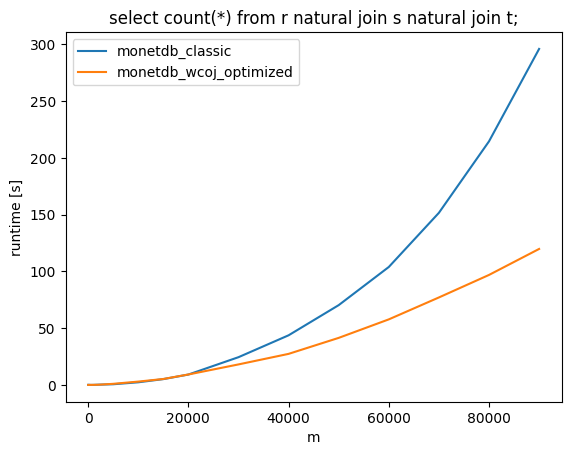
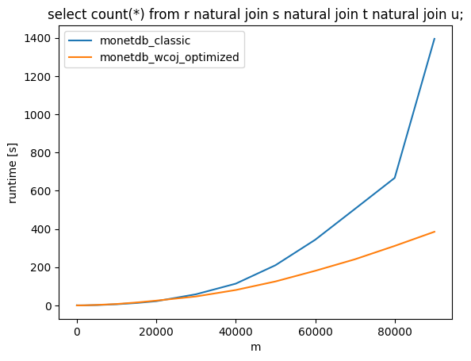
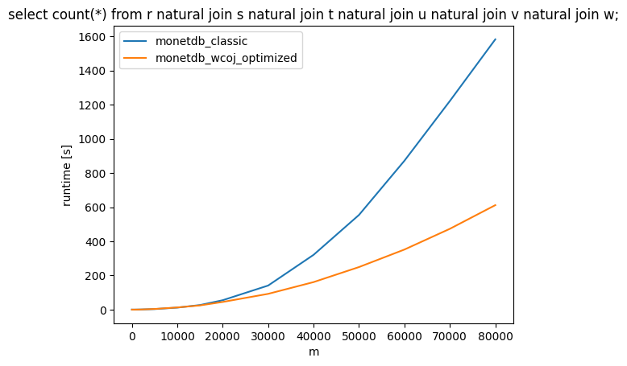
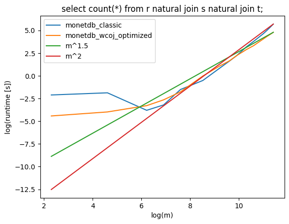
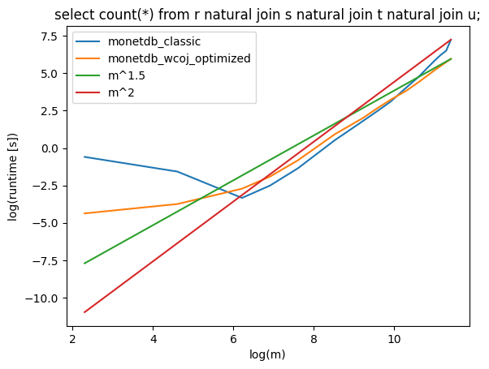
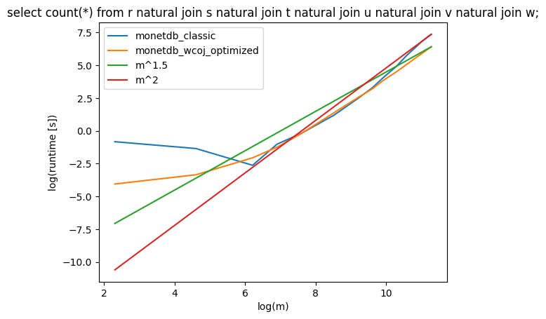
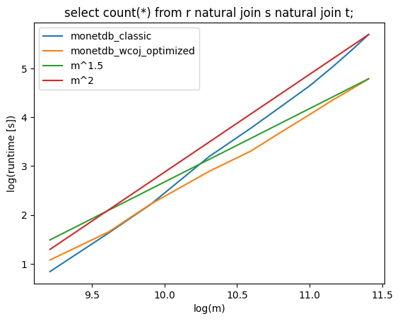
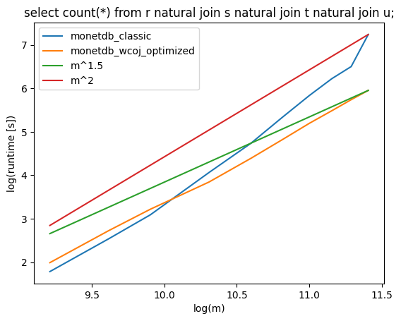
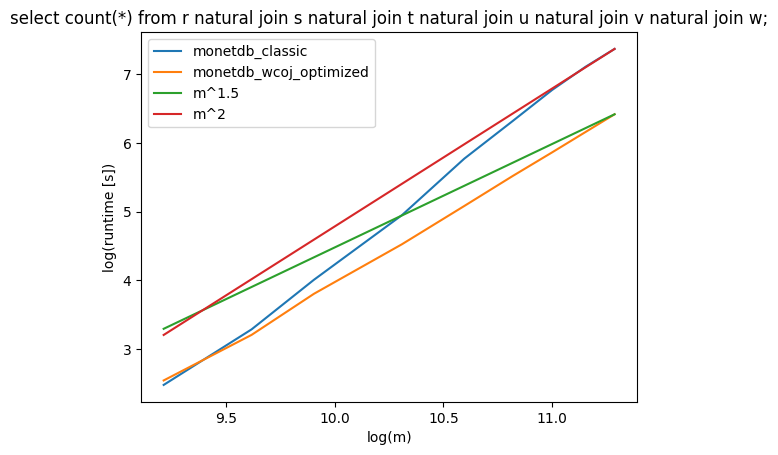

# MonetDB_WCOJ
This repository represents a fork of the MonetDB column-store that has been extended by the possibility of evaluating natural joins according to a class of Worst-Case Optimal Join algorithms. 
The integrated class of Worst-Case Optimal Join algorithms is given by the Generic Join algorithm from Ngo et al. [1]. The MonetDB fork of this repository holds the original query compiler
source code that leverages the traditional pairwise join evaluation approach. Moreover, a copy of this sources has been adapted in order to generate MAL code that evaluates natural joins
according to the Generic-Join algorithm from Ngo et al. [1]. This approach has been shown to increase runtime efficiency of the colum-store system when answering queries on big databases with
highly skewed data.

# Configuration
MonetDB's original query compiler logic is centred around the source file "MonetDB/sql/backends/monet5/rel_bin.c". This logic aims for evaluating joins according to the traditional pairwise paradigm.
This original query compiler logic has been copied and adapted to feature the Multi-Way Join evaluation approach introduced by the Generic-Join algorithm from Ngo et al. [1]. The resulting query compilation
logic is implemented in the source file "MonetDB/sql/backends/monet5/rel_bin_wcoj.c". Having both join evaluation approaches implemented in the same repository enables the system to to be parametrized in order
to use the traditional pairwise approach or the Multi-Way approach introduced by the Generic-Join algorithm from Ngo et al. [1].

To compile the MonetDB system using the WCOJ approach, the **_WCOJ_** flag needs to be defined in the source file "MonetDB/sql/backends/monet5/sql_gencode.c".
The MonetDB system can be compiled using **cmake** in a custom build directory of MonetDB.
'''
cmake --build . --target install
'''

Afterwards, the compiled MonetDB system can be started as usual. Moreover, the **_WCOJ_** flag enables to switch between the WCOJ approach and the original baseline system for benchmarking.
It is also important to note, that the WCOJ approach for natural join queries can only be used for user submitted queries since this is an experimental feature. All other queries are evaluated
using the traditional pairwise approach

# Experimental Evaluation
## Data
The MonetDB system with integrated WCOJ algorithm has been evaluated using 3 different natural join queries that represent settings with highly skewed data as discussed by Ngo et al. [1].
This set of queries is composed of the following:
 * select count(*) from r natural join s natural join t;
	This query is evaluated on a database with relations R(A,B), S(B,C) and T(A,C). The given query is further referred to as **go3**.
 * select count(*) from r natural join s natural join t natural join u;
	This query is evaluated on a database with relations R(A,B,C), S(B,C,D), T(A,C,D) and U(A,B,D). The given query is further referred to as **go4**.
 * select count(*) from r natural join s natural join t natural join u natural join v natural join w;
	This query is evaluated on a database with relations R(A,B,C,D,E), S(B,C,D,E,F), T(A,C,D,E,F), U(A,B,D,E,F), V(A,B,C,E,F) and W(A,B,C,D,F). The given query is further referred to as **go6**.

# Results
The following plots represent the asymptotical results for the 3 different queries averaged accross 3 independent benchmark runs.

The following plots represent the asymptotical results for the 3 different queries averaged accross 3 independent benchmark runs printed in log-log plots.
The later plots zoom into areas for table sizes m > 20.000 entries in order to be able to graphically estimate the runtime. To that end, functions m^(1.5) and m^2 are plotted as well.

# References
[1] https://dblp.org/rec/journals/sigmod/NgoRR13.html